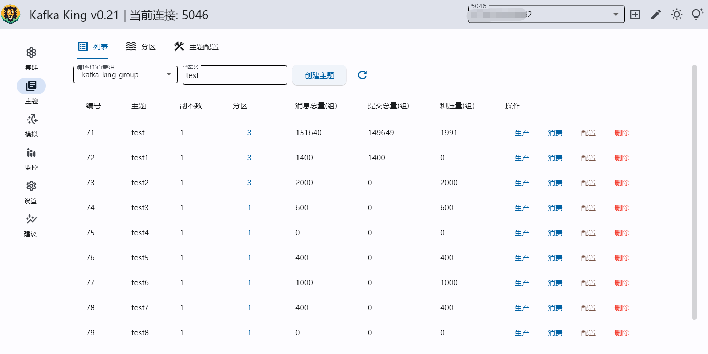
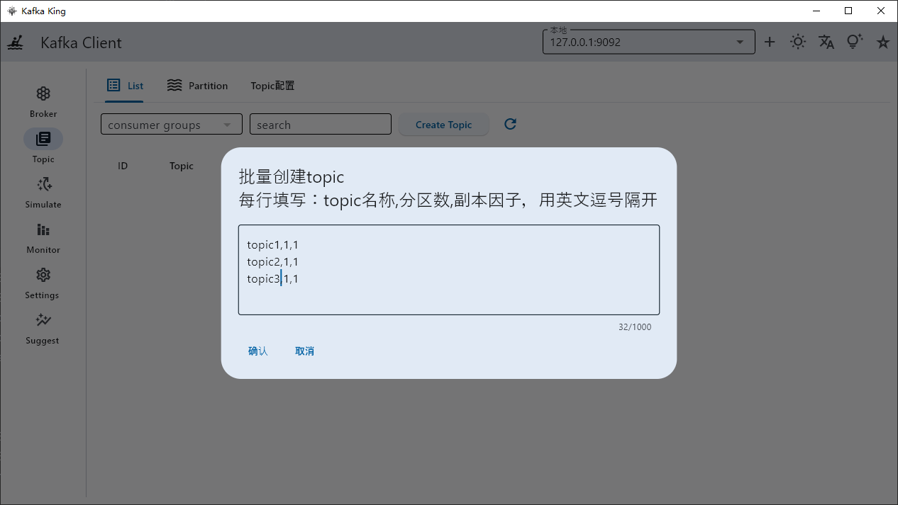
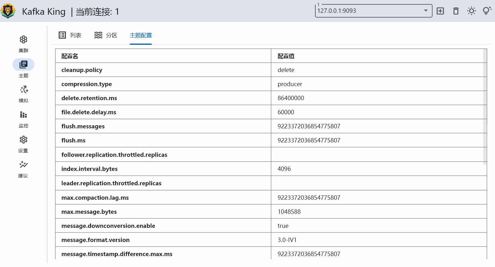
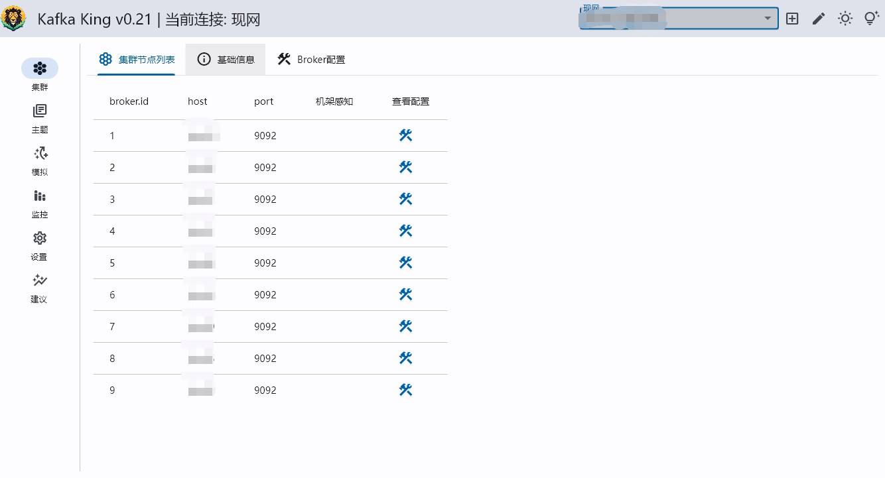
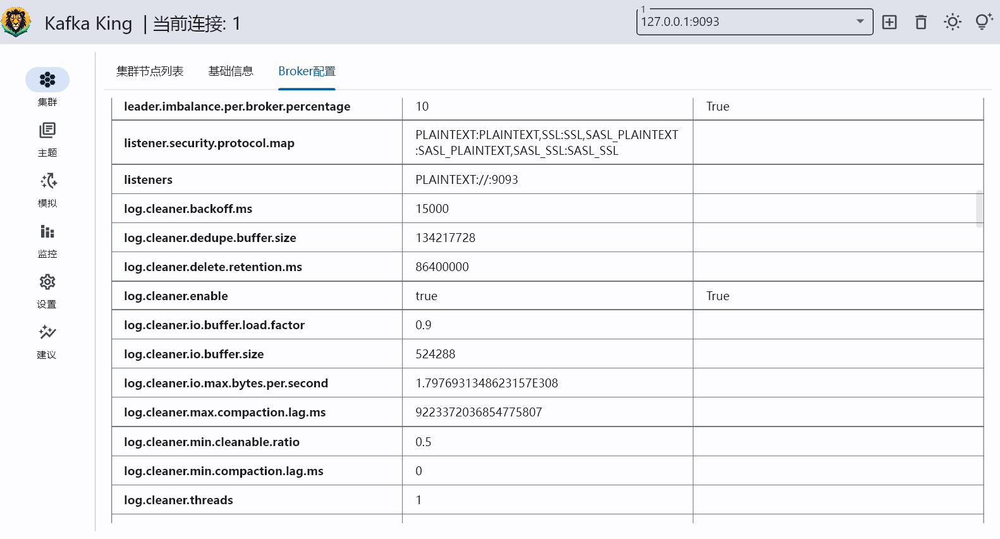
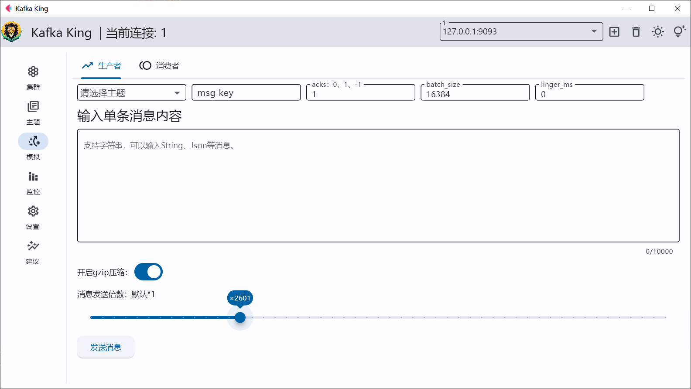
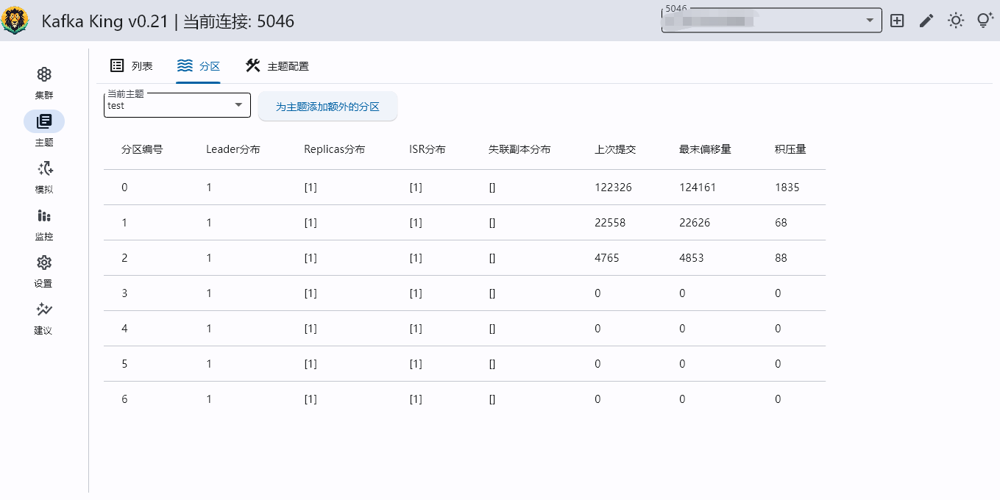

<h1 align="center">Kafka King </h1>

<h4 align="center"><strong>English</strong> | <a href="https://github.com/tiny-craft/tiny-rdm/blob/main/README_zh.md">简体中文</a></h4>

<strong>A modern, practical Kafka client built using Python flet.</strong>

# Feature list
- [x] View cluster node list (completed)
- [x] Create topics (support batches), delete topics, and support statistics of the message backlog of each topic based on consumer groups (completed)
- [x] Support viewing detailed information of topic partitions and adding additional partitions to topics (completed)
- [x] Support viewing the message offset of each partition (completed)
- [x] Support simulated producers, send messages in batches, whether to enable gzip compression, acks, batch_size, liner_ms, you can use it for performance testing (completed)
- [x] Supports simulated consumers, consuming specified sizes according to built-in groups (completed)
- [x] Light and dark theme switching (completed)
- [ ] Parameter description comparison table (under evaluation)
- [ ] Monitoring and alarming (under evaluation)
- [ ] Multi-language support (under development)
- [ ] Configuration (under evaluation)
- ……

# download
[Download address](https://github.com/Bronya0/Kafka-King/releases), click Assets and choose your platform

# Function screenshot

## Manipulate topic
Topic list, supports deleting topics

Supports statistics of the message backlog of each topic based on consumer groups

Create a theme (supports batch)

## View the detailed configuration of the topic

## Automatically obtain the cluster broker list

## Get broker detailed configuration

## Simulate producer-consumer
-Supports simulating producers, sending messages in batches, and whether to enable gzip compression
- Supports simulated consumers, consuming specified sizes according to built-in groups

## Partition operations
- Supports viewing detailed information of topic partitions
- Support adding additional partitions to themes
-Supports viewing the message offset of each partition

# Quick start dev
Select the corresponding version to download under Assets under release on the right.
Or click https://github.com/Bronya0/Kafka-King/releases

# Construct
pip install -r requirements.txt

flet pack main.py -i assets/icon.ico -n kafka-king --add-data=assets/*:assets

# License
Apache-2.0 license

# grateful
- flet-dev: https://github.com/flet-dev/flet