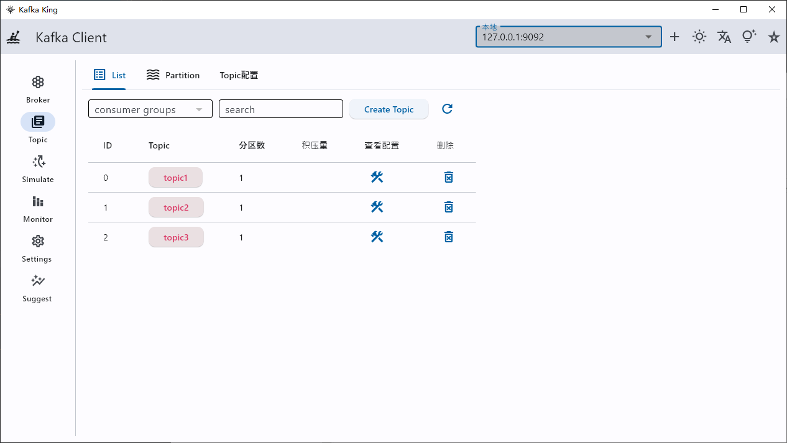
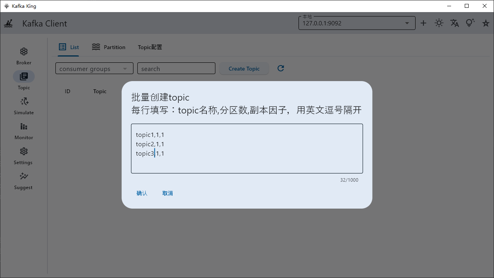
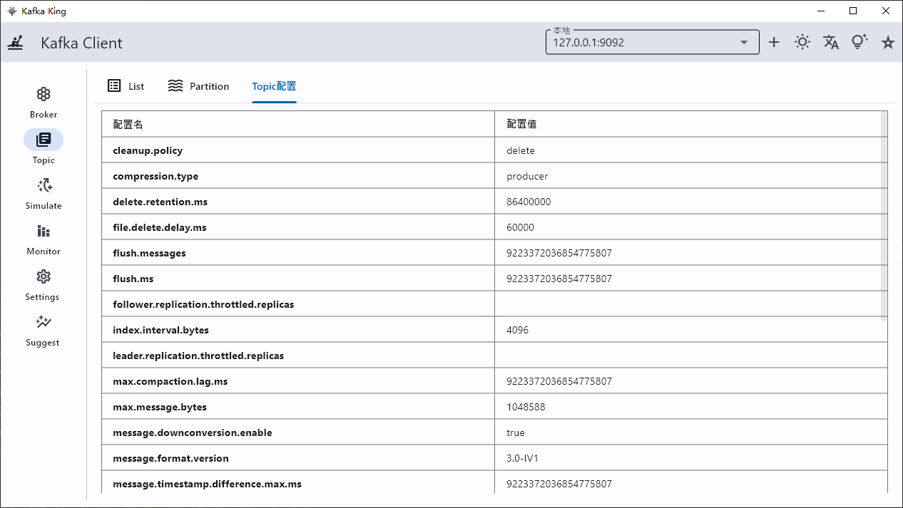
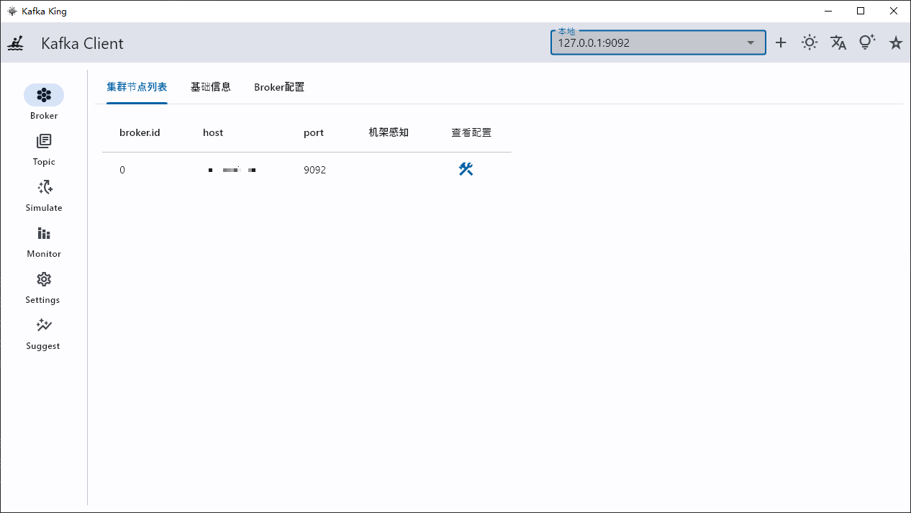
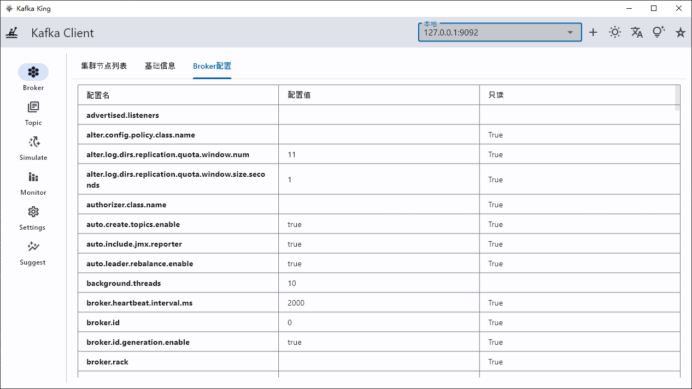
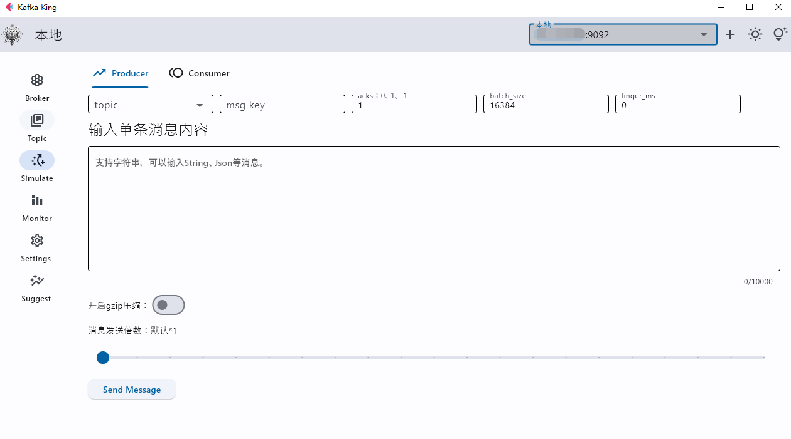
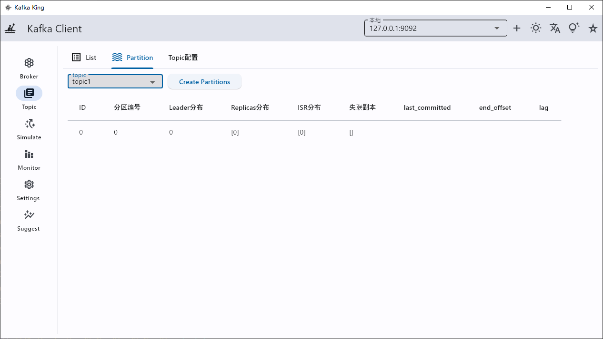

# Kafka King
一个漂亮、现代、实用的kafka客户端，使用python flet构建。

# 功能清单
- 查看集群节点列表（完成）
- 创建主题（支持批量）、删除主题、支持根据消费者组统计每个topic的消息积压量（完成）
- 支持查看topic的分区的详细信息，并为主题添加额外的分区（完成）
- 支持查看每个分区的消息offset（完成）
- 支持模拟生产者，批量发送消息，是否开启gzip压缩（完成）
- 支持模拟消费者，按照内置的组进行指定size的消费（完成）
- 监控、告警（开发中）
- 多语言支持（开发中）
- 光暗主题切换（完成）
- ……

# 功能截图

## 操作topic
主题列表，支持删除主题

支持根据消费者组统计每个topic的消息积压量

创建主题（支持批量）

## 查看topic的详细配置

## 自动获取集群broker列表

## 获取broker详细配置

## 模拟生产者消费者
- 支持模拟生产者，批量发送消息，是否开启gzip压缩
- 支持模拟消费者，按照内置的组进行指定size的消费

## 分区操作
- 支持查看topic的分区的详细信息
- 支持为主题添加额外的分区
- 支持查看每个分区的消息offset

# 快速开始
在右侧release下的Assets选择对应版本下载即可。
或者点击 https://github.com/Bronya0/Kafka-King/releases

# 构建

pip install -r requirements.txt -i https://pypi.douban.com/simple

flet pack main.py -i assets/icon.ico  -n kafka-king

# License
Apache-2.0 license