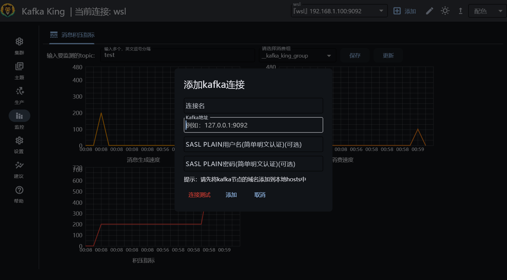
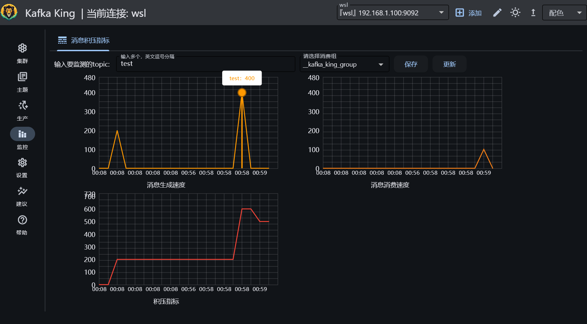
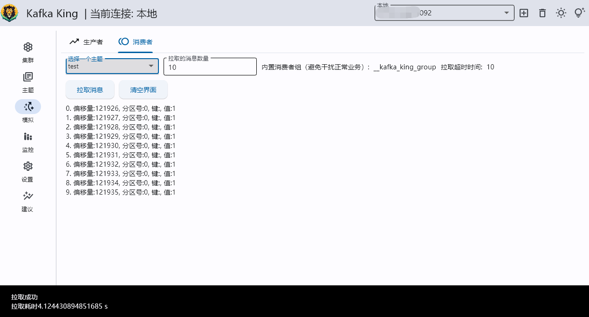

<h1 align="center">Kafka King </h1>

<h4 align="center"><strong>简体中文</strong> | <a href="https://github.com/Bronya0/Kafka-King/blob/main/docs/README_EN.md">English</a></h4>

<strong>一个现代、实用的kafka GUI客户端。</strong>

本项目是一个kafka GUI客户端，支持各个系统，开源免费、简单好用。
点个star支持作者辛苦开源吧 谢谢❤❤

加群和作者一起交流： <a target="_blank" href="https://qm.qq.com/cgi-bin/qm/qr?k=pDqlVFyLMYEEw8DPJlRSBN27lF8qHV2v&jump_from=webapi&authKey=Wle/K0ARM1YQWlpn6vvfiZuMedy2tT9BI73mUvXVvCuktvi0fNfmNR19Jhyrf2Nz">研发技术交流群：964440643</a>
 
同款elasticsearch客户端 `ES-King` ：https://github.com/Bronya0/ES-King 

# Kafka-King功能清单
- [x] 查看集群节点列表（完成）
- [x] 支持PLAINTEXT、SASL PLAINTEXT用户名密码认证（完成）
- [x] 创建（支持批量）、删除主题，指定副本数、分区数（完成）
- [x] 支持根据消费者组统计每个topic的消息总量、提交总量、积压量（完成）
- [x] 支持查看topic的分区的详细信息（offset），并支持添加额外的分区（完成）
- [x] 支持模拟生产者，批量发送消息，是否开启gzip压缩、acks、batch_size、liner_ms，可以用来做性能调优（完成）
- [x] 支持模拟消费者，按照内置的组进行指定size的消费（完成）
- [x] 支持图表监控多个topic的消息生产性能、消费性能、积压情况（完成）
- [x] 健康检查（完成）
- [x] 多彩主题（完成）
- ……

# 下载
[下载地址](https://github.com/Bronya0/Kafka-King/releases)，点击【Assets】，选择自己的平台下载，支持windows、macos、linux。

> 小提示：使用前请检查kafka集群配置的`advertised.listeners`，如果配置是域名，那么在King中填写连接地址时，请提前在本机电脑的hosts文件中添加对应域名解析，否则会因为无法解析域名而报NodeNotReadyError

# 功能截图

读取生产性能、消费性能、积压情况

添加kafka连接，支持添加SASL PLAINTEXT用户名密码认证

## 操作topic
主题列表，支持删除主题

支持根据消费者组统计每个topic的消息积压量（选择某个消费组，点击刷新按钮即可。）

创建主题（支持批量）

## 查看topic的详细配置

## 自动获取集群broker列表

## 模拟生产者消费者
- 支持模拟生产者，批量发送消息，是否开启gzip压缩
- 支持模拟消费者，按照内置的组进行指定size的消费

## 分区操作
- 支持查看topic的分区的详细信息
- 支持为主题添加额外的分区
- 支持查看每个分区的消息offset

# 快速开始
在右侧release下的Assets选择对应版本下载即可。
或者点击 https://github.com/Bronya0/Kafka-King/releases

# 构建

pip install -r requirements.txt

flet pack main.py -i assets/icon.ico  -n kafka-king --add-data=assets/*:assets --product-name kafka-king

## QQ交流群
<a target="_blank" href="https://qm.qq.com/cgi-bin/qm/qr?k=pDqlVFyLMYEEw8DPJlRSBN27lF8qHV2v&jump_from=webapi&authKey=Wle/K0ARM1YQWlpn6vvfiZuMedy2tT9BI73mUvXVvCuktvi0fNfmNR19Jhyrf2Nz">KingTool研发技术交流群：964440643</a>

# Star星星

# License
Apache-2.0 license

# 感谢
- flet-dev：https://github.com/flet-dev/flet
- kafka-python：https://github.com/dpkp/kafka-python
